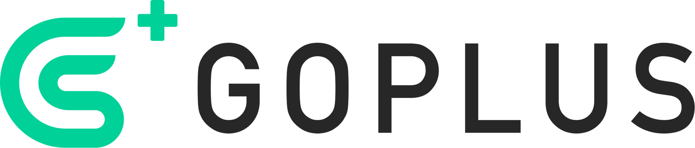

# Awesome GoPlus Security

An awesome & curated list of resources related to [GoPlus Security](https://gopluslabs.io/). 

## What is GoPlus Security?
[GoPlus Security](https://gopluslabs.io/) works as the security infrastructure for web3 by providing open, permissionless, user-driven security services. GoPlus is building on the security data infrastructure and security service platform, making a safer web3 Ecosystem.

GoPlus Security provides fast, reliable and convenient security services by providing free, real-time, dynamic, and automated security detecting APIs:
- [Token Security API](https://gopluslabs.io/#token_detection) - Open, permissionless, user-driven token security detection platform. 
- [Malicious Address API](https://gopluslabs.io/#aml_api) - Free, timely and comprehensive malicious address library.
- [NFT Security API](https://gopluslabs.io/#nft_detection) - NFT authenticity detection platform. 
- [Approval Security API](https://gopluslabs.io/#approval_security) - Detect risks of token approvals.
- [dApp Security Info API](https://gopluslabs.io/#dapp_security) - Aggregate dApp security info for quick risk alerts.
- [Signature Data Decode API](https://gopluslabs.io/#signature_api) - Decode ABI data and find abnormalities in time.

For using GoPlus Security API, check the [official website](https://gopluslabs.io/), and for integrating GoPlus Security API with your applications and platforms, check the [API reference and documentation](https://docs.gopluslabs.io/).

## Projects
Projects contains awesome **open source** projects built with GoPlus Security APIs.
- [AlgoRisk Terminal](https://github.com/andrewsiah/risk-terminal) - A robust risk management tool for trading teams in the cryptocurrency market.
- [MEV NFT - Data Shield](https://github.com/PeterisPrieditis/ETHDenver23-DataShield) - Protecting users against crypto scams and phishing attacks! Leveraging analytics to find smart money.
- [Nimbus](https://github.com/getnimbus/nimbus-ext) - A personalized portfolio for Web3 that integrated with GoPlus Security APIs to provides users more information about the risks when they make an investment in cryptocurrencies and other position protocols.
- [Petting Bufficorn](https://github.com/buryhuang/ethdenver-petting-bufficorn) - Petting Bufficorn is a contract risk and security user experience project. With the visual interactions of the pet Bufficorn, user can much easier to be engagned to be warned of risks for DeFi transactions.
- [PlusBot](https://github.com/hardtogivename/plusbot) - A Discord bot built using GoPlus Security APIs to provides users with a range of commands that can be used to find chain IDs, scan for scams, harmful contracts, and NFTs.
- [The Whale Wallet](https://github.com/thewhalewallet/thewhalewallet) - A wallet and account aggregator which lets users keep track of traditional fiat finances/assets and crypto assets all in one place for integrated management of user's wealth.
- [NFT Scores](https://github.com/JisongImSorry/gmvietnam-nftscores.git) - A NFT evaluation scoring system, where user can evaluate the NFT's security with just a click.

## User Cases
### Market Analysis Platform
- [ApeSpace](https://apespace.io/) - A crypto analytics platform for all traders. 
- [Avedex](https://avedex.cc/) - A on-chain market data information provider. 
- [CoinBrain](https://coinbrain.com/) - Real-time Cryptocurrency Analytics and Market Insight. 
- [CoinMarketCap](https://coinmarketcap.com/) - A platform for crypto analysis, news and updates. 
- [CryptoGems](https://www.cryptogems.info/) - A voting platform for cryptocurrencies. 
- [DEXTools](https://www.dextools.io) - The gateway to DEFI, real-time charts, history and all token info from blockchain. 
- [DexCheck](https://dexcheck.io/) - An AI-enhanced blockchain analytics and data-driven trading tools on a unified platform. 
- [GeckoTerminal from Gecko](https://www.geckoterminal.com/) - Decentralized Exchange (DEX) Tracker Tool, track real-time cryptocurrency prices, trading and transaction volume, liquidity in a pool across Ethereum, BSC, Solana network and more. 
- [Nimbus](https://getnimbus.io/) - A personalized portfolio for Web3. Users can use it to track their portfolio, access data and analytics for decentralized lending protocols, stablecoins, margin trading platforms and DEXes. 

### DEX
- [Flooz](https://flooz.xyz/) -  A platform to buy, trade and track any crypto. 
- [O3swap](https://o3swap.com/) - A cross-chain aggregation protocol that enables free trading of native assets between heterogeneous chains. 

### Wallet
- [BitKeep](https://bitkeep.com) - A multi-chain web3 DeFi wallet for effortless trading. 
- [ONTO Wallet](https://onto.app/) - A decentralized multi-chain gateway for identity and asset management.   
- [OneKey Wallet](https://www.onekey.so/) - An Open source crypto wallet.   
- [SafePal](https://www.safepal.com/) - A crypto hardware wallet.    
- [TokenPocket](https://www.tokenpocket.pro/) - A multi-chain crypto wallet.  

### SocialFi
- [Mask Network](https://mask.io/) - A portal to brings privacy and benefits from Web3 to social media.  
### Browser
- [Opera Crypto Browser](https://www.opera.com/crypto/next) - A web3 browser for crypto users.  

## Blogs
- [Tutorial on Getting the GoPlus X SafePal OAT](https://goplussecurity.medium.com/tutorial-on-getting-the-goplus-x-safepal-oat-82b1d14d991b)
- [Blaze a Secure Trail in Web3 with GoPlus Forest Adventure](https://goplussecurity.medium.com/blaze-a-secure-trail-in-web3-with-goplus-forest-adventure-d37863dbba3f)
- [GoPlus Security: Trailblazing Web3 Safety](https://goplussecurity.medium.com/goplus-security-trailblazing-web3-safety-b88f00825227)
- [A Brief Analysis of the Web3 Music Platform Audius Exploit](https://goplussecurity.medium.com/a-brief-analysis-of-the-web3-music-platform-audius-exploit-79b3e9884c8d)
- [A Brief Explanation of the Surge in Arbitrum Gas Fee on June 29, 2022](https://goplussecurity.medium.com/a-brief-explanation-of-the-surge-in-arbitrum-gas-fees-on-june-29-2022-53cfa280e44c)
- [Analysis of Rentable NFT Proposal EIP-4907](https://goplussecurity.medium.com/analysis-of-rentable-nft-proposal-eip-4907-e64cbe1d9ca7)
- [Analysis of the MEV Bot Attack on Alpha Homora](https://goplussecurity.medium.com/analysis-of-the-mev-bot-attack-on-alpha-homora-7f6d34caa0dc)
- [ApeSpace: The Ultimate Crypto Analytics Platform for All Traders](https://goplussecurity.medium.com/apespace-the-ultimate-crypto-analytics-platform-for-all-traders-fe4d08c66fda)
- [Avedex: A Decentralized Crypto Data Aggregator Platform](https://goplussecurity.medium.com/avedex-a-decentralized-crypto-data-aggregator-platform-317a6e43a2b1)
- [CoinBrain Helps Traders Navigate Signals through the Crypto Noise](https://goplussecurity.medium.com/coinbrain-helps-traders-navigate-signals-through-the-crypto-noise-d773c49e5d76)
- [DexCheck - The Next Generation Data Analytics Platform for DeFi and NFT](https://goplussecurity.medium.com/dexcheck-the-next-generation-data-analytics-platform-for-defi-and-nft-8ee29ec2d6b0)
- [Footprint Analytics ✖️GoPlus Security: Establishing Strategic Partnerships](https://goplussecurity.medium.com/footprint-analytics-%EF%B8%8Fgoplus-establishing-strategic-partnerships-a1ad87333ceb)
- [Go+ & BNB Chain AMA Recap](https://goplussecurity.medium.com/go-bnb-chain-ama-recap-e72e7a80ef8f)
- [Go+ Launched NFT Security Detection API Service](https://goplussecurity.medium.com/go-nft-launched-security-detection-api-service-53bd2bebe030)
- [Go+ Reaches Partnership with Kucoin Community Chain to Provide Comprehensive Security Detection Service to KCC](https://goplussecurity.medium.com/go-reaches-partnership-with-kucoin-community-chain-to-provide-comprehensive-security-detection-4c88bd4c9a53)
- [Go+ Security Announcing Support for Cronos Chain](https://goplussecurity.medium.com/go-security-announcing-support-for-cronos-chain-7323eeda8348)
- [Go+ Security Engine: Solving Everpresent Security Issues in the Crypto Industry](https://cryptopotato.com/go-security-engine-solving-everpresent-security-issues-in-the-crypto-industry/)
- [Go+ Security Helps Provide a Safer Web 3.0 Experience](https://beincrypto.com/go-security-helps-provide-a-safer-web-3-0-experience/)
- [Go+ Security Integrates zkSync Ecosystem into the Security Service](https://goplussecurity.medium.com/go-security-integrates-zksync-ecosystem-into-the-security-service-50fd19f2e762)
- [Go+ Security Is Honored to Join BSC MVB IV Incubation Program](https://goplussecurity.medium.com/go-security-is-honored-to-join-bsc-mvb-iv-incubation-program-a2186636217b)
- [Go+ Security Launched Malicious Address API Service](https://goplussecurity.medium.com/go-security-launched-malicious-address-api-service-fb18214389b4)
- [Go+ Security Supports Harmony Ecosystem for Token Security Detection](https://goplussecurity.medium.com/go-security-supports-harmony-ecosystem-for-token-security-detection-a7fde23cc337)
- [GoPlus Launches Approved Contract Security Detection V2, One Click to Check Risky Approvals!](https://goplussecurity.medium.com/goplus-launches-approved-contract-security-detection-v2-one-click-to-check-risky-approvals-5119f3a13804)
- [GoPlus Provides Security Data Support for Opera Crypto Browser](https://goplussecurity.medium.com/goplus-provides-security-data-support-for-opera-crypto-browser-e50fb5a18cac)
- [GoPlus Recap: The Blockchain Security 2022](https://goplussecurity.medium.com/its-been-quite-a-tough-year-for-all-of-us-967c9e256ba1)
- [GoPlus Security & SlowMist Submit EIP with Expiration Limits for Contract Approvals to Address the Problem of User Asset Theft Caused by Unlimited Contract Approval](https://goplussecurity.medium.com/goplus-security-slowmist-submits-eip-with-expiration-limits-for-contract-approvals-to-address-the-a0bc570d94de)
- [GoPlus Security Assists DEXTools with Security Attribute Enhancement](https://goplussecurity.medium.com/goplus-security-assists-dextools-with-security-attribute-enhancement-ad3390bcd4f)
- [GoPlus Security Enters into Strategic Partnership with Crypto Wallet OneKey](https://goplussecurity.medium.com/goplus-security-enters-into-strategic-partnership-with-crypto-wallet-onekey-9f5e92966172)
- [GoPlus Security Enters into a Strategic Partnership with Crypto Wallet Assure](https://goplussecurity.medium.com/goplus-security-enters-into-a-strategic-partnership-with-crypto-wallet-assure-daae2966b7de)
- [GoPlus Security Improves Web3 Security and Latency on AWS](https://aws.amazon.com/solutions/case-studies/goplus-case-study/)
- [GoPlus Security Support Dtools for New Token Security Detection](https://goplussecurity.medium.com/goplus-security-support-dtools-for-new-token-security-detection-1b63556df1da)
- [GoPlus Security Support TokenPocket for New Token Security Detection](https://goplussecurity.medium.com/goplus-security-support-tokenpocket-for-new-token-security-detection-db6b833003af)
- [GoPlus Security Supports ApeSpace for Token Security Detection Feature](https://goplussecurity.medium.com/goplus-security-supports-apespace-for-token-security-detection-feature-d18ff8a66286)
- [GoPlus Security Teams Up with 0xScope: Bolster the Growing in Web3 Security](https://goplussecurity.medium.com/goplus-security-teams-up-with-0xscope-bolster-the-growing-in-web3-security-8bb3e9c533ec)
- [GoPlus Security Teams Up with EigenPhi: Jointly Protecting Web3 Security](https://goplussecurity.medium.com/goplus-security-teams-up-with-eigenphi-jointly-protecting-web3-security-c5549c7265e8)
- [GoPlus Security Teams Up with Safeheron: Bolstering Growth for Web3 Security](https://goplussecurity.medium.com/goplus-security-teams-up-with-safeheron-bolstering-growth-for-web3-security-b2e28a9e632c)
- [GoPlus Security and Numen Enter into a Strategic Partnership](https://goplussecurity.medium.com/goplus-security-and-numen-enter-into-a-strategic-partnership-8bdef54d8bb)
- [Honeypot Attacks Increased 6-Fold in the Past Week, Targeting New Users of Decentralized Exchange](https://goplussecurity.medium.com/honeypot-attacks-increased-6-fold-in-the-past-week-targeting-new-users-of-decentralized-exchange-74bd5a2586fe)
- [How Did My Tokens Disappear? GoPlus Security Explains the New Token Risk of "Contract Self-Destruction"!](https://goplussecurity.medium.com/how-did-my-tokens-disappear-goplus-security-explains-the-new-risk-of-contract-self-destruction-35bef4a396c5)
- [How to Access Go+ Token Detection Service Easily on Ave.ai?](https://goplussecurity.medium.com/how-to-access-go-token-detection-service-easily-on-ave-ai-460bd0e011f1)
- [JDB: A Must-Have Tool to Optimize Crypto Trading & Investing Decisions](https://goplussecurity.medium.com/jdb-a-must-have-tool-to-optimize-crypto-trading-investing-decisions-564bbfa2f3d4)
- [Learn Security Risks with A New Honeypot Scam](https://goplussecurity.medium.com/learn-security-risks-with-a-new-honeypot-scam-36bdbf772aa3)
- [Mask Network: The Bridge Connecting Web2 Platforms with Web3 Principles](https://goplussecurity.medium.com/mask-network-the-bridge-connecting-web2-platforms-with-web3-principles-e05072a5730e)
- [NFT Liquidity Solver XCarnival Was Exploited with a Total Loss of 3087 ETH](https://goplussecurity.medium.com/nft-liquidity-solver-xcarnival-was-exploited-with-a-total-loss-of-3087-eth-b2e1c57720ed)
- [NFT Security API Update – Approval Objects Restriction and Contract Self-Destruction](https://goplussecurity.medium.com/nft-security-api-update-approval-objects-restriction-and-contract-self-destruction-62a1c979d06a)
- [ONTO Wallet: Build an Easy to Use Experience and Navigate a Secure Future in Web 3.0](https://goplussecurity.medium.com/onto-wallet-build-an-easy-to-use-experience-and-navigate-a-secure-future-in-web-3-0-5e7230bbd248)
- [OneKey: A Simple Crypto Wallet with Bulletproof Security](https://goplussecurity.medium.com/onekey-a-simple-crypto-wallet-with-bulletproof-security-7fba744cf67b)
- [Protecting Yourself in the Dark Forest of Web3](https://dappbay.bnbchain.org/topic/122-protecting-yourself-in-the-dark-forest-of-web3)
- [The Analysis of Nomad Cross-Chain Bridge Exploitation](https://goplussecurity.medium.com/the-analysis-of-nomad-cross-chain-bridge-exploitation-f03c03991920)
- [The Journey towards Web3 Security Infrastructure: An Interview with Go+ Security Founder Mike](https://ambcrypto.com/the-journey-towards-web3-security-infrastructure-an-interview-with-go-security-founder-mike/)
- [The Qatar World Cup Is Coming, Watch Out for Scams While Enjoying The Last Performance of the Football Superstars](https://goplussecurity.medium.com/the-qatar-world-cup-is-coming-watch-out-for-scams-while-enjoying-the-the-last-performance-of-the-e12d08dbeeff)
- [The Web3 Security Infrastructure Go+ Security Engine Launches Token Security Detection Function for Overall Crypto Investors](https://www.newsbtc.com/press-releases/the-web3-security-go-plus-security-engine-launches-token-security-detection/)
- [TokenPocket: A Secure and Simple Multi-Chain Wallet](https://goplussecurity.medium.com/tokenpocket-a-secure-and-simple-multi-chain-wallet-cebc5591f1d5)
- [Ukraine Airdrop Canceled, Why I Brought Ukraine DAO Token?](https://goplussecurity.medium.com/ukraine-airdrop-canceled-why-i-brought-ukraine-dao-token-e8006ff32d87)
- [Web3 Security Ecosystem Infrastructure Go+ Security Provides Security Support for NFTPlay](https://goplussecurity.medium.com/web3-security-ecosystem-infrastructure-go-security-provides-security-support-for-nftplay-84fe6b6f9973)
- [Web3 Security Ecosystem Infrastructure GoPlus Security Provides Security Detection Services to Hardware Wallet Keystone](https://goplussecurity.medium.com/web3-security-ecosystem-infrastructure-goplus-security-provides-security-detection-services-to-85b6e90bf5df)
- [Web3 Security Infrastructure GoPlus Security Services Fully Supports KCC Now](https://goplussecurity.medium.com/web3-security-infrastructure-goplus-security-services-fully-supports-kcc-now-46e05e670dbe)
- [What Should I Do When My Assets Cannot Be Sold?](https://goplussecurity.medium.com/what-should-i-do-when-my-assets-cannot-be-sold-f9f2840f1cd2)
- [Why Can't I Sell My Token When Others Can? GoPlus Security Explains the "Sniper" Token – Modify Personal Tax for Individual Addresses](https://goplussecurity.medium.com/why-cant-i-sell-my-token-when-others-can-250d55af0f38)
- [Wintermute Wallet Is Exploited, Probably Due to the Vanity Wallet Created with Profanity](https://goplussecurity.medium.com/wintermute-wallet-is-exploited-probably-due-to-the-vanity-wallet-created-with-profanity-572873f43ab3)
- [YouTube Tutorial Presents 718% Return on Staking! – The Latest Secret Web3 Phishing Scam](https://goplussecurity.medium.com/youtube-tutorial-presents-718-return-on-staking-the-latest-secret-web3-phishing-scam-49a2886a052b)

## Contribute
Contributions are most welcome, please adhere to the [contribution guidelines](CONTRIBUTING.md).
